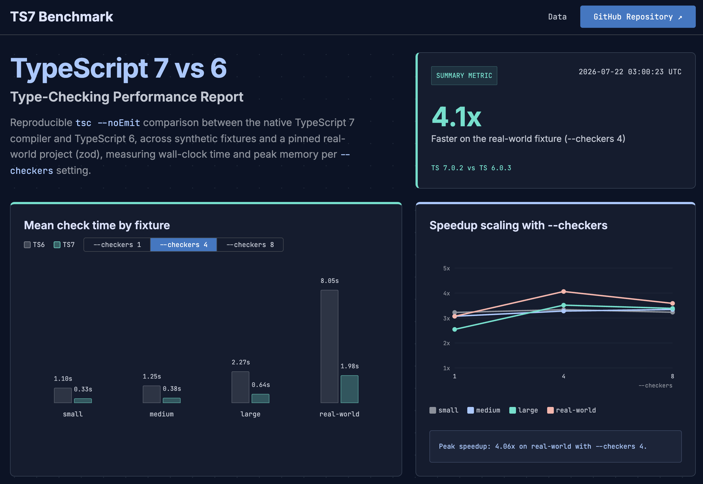

# TypeScript 7 vs 6 — Type-Checking Benchmark

🇺🇸 English | [🇰🇷 한국어](./README.ko.md)

[](https://github.com/youngilNoh/ts7-benchmark/actions/workflows/benchmark.yml)
[](./LICENSE)
[](https://yesimnoh.github.io/ts7-benchmark/)

This benchmark checks how much faster the native TypeScript 7 compiler type-checks compared to TypeScript 6, instead of just repeating the "10x faster" claims you see online. It runs `tsc --noEmit` on synthetic fixtures (generated at controlled sizes) and one pinned real-world project ([zod](https://github.com/colinhacks/zod)), and records wall-clock time and peak memory. TS7 can also type-check in parallel, so this measures how results change with its new `--checkers` option. Numbers update automatically every week via GitHub Actions and get published to an interactive dashboard.

**▶ Live dashboard: https://yesimnoh.github.io/ts7-benchmark/**



---

## Goals

The point of this project is to verify TS7's speed claims, not just repeat them. That means:

- **Reproducible** — clone it, run a few commands, get numbers you can compare. Compiler versions are pinned, and the real-world fixture is pinned to an exact commit.
- **Honest** — it reports exactly what was measured (type-checking only), on what hardware, over how many runs. See [Limitations](#limitations) for what it doesn't cover.
- **Scale-aware** — measured across four fixture sizes and three `--checkers` settings, so you can see where the speedup actually comes from, not just one headline number.

## Results

TS7 type-checks roughly **3–4× faster** than TS6 across the fixtures. Most of that gain shows up going from `--checkers 1` to `--checkers 4`. On the current CI runner (4 CPU cores), `--checkers 8` doesn't help much beyond that, and is sometimes a little slower — there just aren't enough cores to keep 8 workers busy. On a machine with more cores, that ceiling would likely move higher.

> [!TIP]
> This is the [`--checkers` theory](#why-ts7-has-a---checkers-option-and-ts6-doesnt) showing up directly in the data: more checker workers than you have CPU cores can't run in parallel, so they stop helping (and can even add a little overhead). The CI runner here has 4 cores, and sure enough, `--checkers 8` barely beats — and sometimes loses to — `--checkers 4`. Run it on a machine with 8+ cores and you'd expect that ceiling to move.

The synthetic fixtures show a smaller, flatter speedup than the real-world project (zod), which leans on complex generics and benefits the most from extra checkers, up to the core count.

For the current numbers, the interactive charts, and a full data table, see the **[live dashboard](https://yesimnoh.github.io/ts7-benchmark/)**.

Raw data lives in [`results/`](./results/). The merged file the dashboard reads is [`results/summary.json`](./results/summary.json); its shape is documented at the top of [`scripts/collect-results.ts`](./scripts/collect-results.ts).

## Methodology

### The two compilers

| Alias | Package | Invoked as |
| --- | --- | --- |
| **TS7** | `typescript@7` (the native / Go compiler) | `npm run ts7 -- …` |
| **TS6** | `@typescript/typescript6` | `npm run ts6 -- …` |

Both compilers are invoked through `package.json` scripts (`npm run ts6` / `npm run ts7`), not `npx tsc`. Reason: installing `@typescript/typescript6` pulls a real TypeScript 6 into the tree, and it and TypeScript 7 both want the `tsc` binary name. `npx tsc` ends up resolving to whichever one won that name collision (TS6), so it's not reliable. The `ts6` / `ts7` scripts point at each compiler by path instead, so there's no ambiguity about which one ran.

### Why TS7 has a `--checkers` option (and TS6 doesn't)

TypeScript 7 rewrote the compiler in Go (this is the "native" compiler, previously called *typescript-go*). That's what makes parallel type-checking possible:

- TypeScript 5/6 run on a single-threaded JavaScript runtime, and the type checker builds one large, shared, mutable graph of state (symbols, types, inference results). JS worker threads don't share memory — moving that graph between threads would mean copying all of it, which is too slow to be worth it. So checking on multiple cores was never really an option.
- Go supports cheap concurrency (goroutines) and shared memory, so the native compiler can run several checker workers over the same program at once.

`--checkers N` is that setting: how many parallel checker workers to use (default `4`). Each worker gets its own view of the program, but the work is split up the same way every time for the same input — so changing the checker count changes speed and memory, never which errors get reported. More checkers use more cores and more memory (each worker keeps its own state), which is why memory-constrained CI often sticks to `--checkers 1`.

This benchmark runs TS7 at `--checkers 1`, `4`, and `8` for every fixture to see how it scales. TS6 has no such setting, so it's measured once per fixture and that single result is reused as the baseline for all three checker rows.

### Fixtures

- **Synthetic** (`small` / `medium` / `large`) — generated by [`fixtures/synthetic/generate.ts`](./fixtures/synthetic/generate.ts), which emits random-but-valid interfaces and generic functions until a target line count is reached. Sizes are chosen by total line count (~500 / ~15k / ~120k lines).
- **Real-world** — [zod](https://github.com/colinhacks/zod), added as a git submodule pinned to commit `912f0f5`. It's checked with a small [`zod.tsconfig.bench.json`](./fixtures/real-world/zod.tsconfig.bench.json) that extends zod's own config and only disables two unused-variable lint rules (zod's test files intentionally declare type-assertion-only locals). We do **not** modify zod's source.

### Measurement

- **Time** — [`hyperfine`](https://github.com/sharkdp/hyperfine) with 2 warmup runs + 10 timed runs, reporting mean / median / standard deviation.
- **Memory** — peak resident set size (`Maximum resident set size`) via GNU `time -v`.
- **Runner** — the committed numbers come from a GitHub Actions Ubuntu runner; the runner's CPU/RAM is recorded in `summary.json` so results are always self-describing.

## Limitations

Please read the numbers with these caveats in mind:

1. **TS7 is a preview.** The native compiler does not yet support the full TypeScript API surface or every config option. Treat it as "where things are heading," not a drop-in replacement today.
2. **CI runners are noisy.** GitHub Actions uses shared virtual machines, so absolute times vary run to run. Trust the *ratios* and *trends* far more than any single millisecond figure; for precise numbers, run it locally on a quiet machine.
3. **Synthetic code isn't real code.** The generated fixtures stress type-declaration volume, not the messy patterns of real applications. The zod fixture is included precisely because synthetic code can't represent everything.
4. **Type-checking only.** This measures `tsc --noEmit`. It does not measure emit, bundling, incremental builds, or editor/language-server latency.
5. **One machine class at a time.** A single run reflects one runner's core count and memory. `--checkers` scaling in particular depends heavily on how many cores are available.

## Reproduce locally

**Prerequisites:** Node.js 24+ (it runs the `.ts` scripts directly), [`hyperfine`](https://github.com/sharkdp/hyperfine), GNU `time` (macOS: `brew install gnu-time` provides `gtime`; Linux has it built in), and [`pnpm`](https://pnpm.io/) (zod is a pnpm workspace).

```bash
# 1. Clone with the zod submodule
git clone --recurse-submodules https://github.com/youngilNoh/ts7-benchmark.git
cd ts7-benchmark

# 2. Install both compilers (prints the resolved { ts6, ts7 } versions)
./scripts/install-both.sh

# 3. Install the real-world fixture's dependencies
(cd fixtures/real-world/zod && pnpm install --filter zod...)

# 4. Generate the synthetic fixtures (small / medium / large)
node fixtures/synthetic/generate.ts --files 10 --linesPerFile 50
node fixtures/synthetic/generate.ts --files 10 --linesPerFile 1500
node fixtures/synthetic/generate.ts --files 20 --linesPerFile 6000

# 5. Run the benchmark (TS6 once per fixture, TS7 × checkers 1/4/8)
./scripts/run-bench.sh

# 6. Merge everything into results/summary.json
node scripts/collect-results.ts
```

To view the dashboard against your local results:

```bash
cd site
npm install
npm run dev      # open the printed http://localhost:5173
```

## Repository structure

```
fixtures/
  synthetic/        generate.ts + generated <size>/ folders
  real-world/       zod (submodule) + zod.tsconfig.bench.json
scripts/
  install-both.sh   install both compilers, print versions as JSON
  run-bench.sh      hyperfine + memory across fixtures × checkers
  collect-results.ts  merge raw output into results/summary.json
results/            per-run JSON + memory logs, and summary.json (CI-committed)
site/               Vite dashboard (deployed to GitHub Pages)
.github/workflows/  benchmark.yml — run, commit results, deploy the site
```

## Automation

[`benchmark.yml`](./.github/workflows/benchmark.yml) runs on a weekly schedule (and can be triggered manually). It prints the runner spec, installs everything, regenerates the fixtures, runs the benchmark, commits the refreshed `results/`, and deploys the dashboard to GitHub Pages.

## Contributing

Contributions are welcome — see [CONTRIBUTING.md](./CONTRIBUTING.md).

## License

[MIT](./LICENSE) © Charlie. The bundled zod fixture is MIT-licensed and remains the property of its authors.

## Acknowledgments

- The TypeScript team and the [native compiler](https://github.com/microsoft/typescript-go) effort.
- [zod](https://github.com/colinhacks/zod) — the real-world fixture.
- [hyperfine](https://github.com/sharkdp/hyperfine) — the benchmarking harness.
